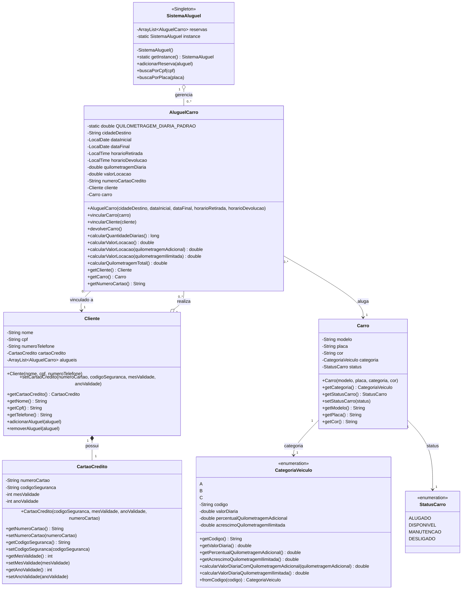

# Sistema de Aluguel de Carros UFBAir

Sistema completo de gestão de aluguel de carros desenvolvido em Java, com suporte a múltiplas categorias de veículos, gestão de clientes, reservas e consultas. Implementa o padrão Singleton para gerenciamento centralizado de todas as reservas do sistema.

## Diagrama de Classes



## Descrição das Classes

### Classe `SistemaAluguel` (Singleton)

Classe responsável por gerenciar todas as reservas do sistema de forma centralizada.

**Padrão de Design:** Singleton - garante que existe apenas uma instância do sistema, concentrando todas as reservas em um único local.

**Atributos:**
- `reservas`: Lista de todas as reservas realizadas no sistema
- `instance`: Instância única da classe (static)

**Métodos principais:**
- `getInstance()`: Retorna a instância única do sistema (static)
- `adicionarReserva()`: Adiciona uma nova reserva ao sistema
- `buscaPorCpf()`: Busca e exibe todas as reservas de um cliente pelo CPF
- `buscaPorPlaca()`: Busca e exibe a reserva de um veículo pela placa

**Características:**
- Construtor privado impede criação de múltiplas instâncias
- Método `getInstance()` garante acesso controlado à instância única
- Centraliza todas as operações de consulta do sistema

### Classe `Cliente`

Representa um cliente do sistema de aluguel.

**Atributos:**
- `nome`: Nome completo do cliente
- `cpf`: CPF do cliente
- `numeroTelefone`: Telefone de contato
- `cartaoCredito`: Cartão de crédito para pagamento (composição)
- `alugueis`: Lista de aluguéis realizados pelo cliente

**Métodos principais:**
- `setCartaoCredito()`: Cadastra ou atualiza o cartão de crédito do cliente
- `adicionarAluguel()`: Adiciona um aluguel à lista (verifica duplicatas)
- `removerAluguel()`: Remove um aluguel da lista

**Relacionamentos:**
- Possui um CartaoCredito (composição 1:1)
- Realiza vários AluguelCarro (agregação 1:N)

### Classe `CartaoCredito`

Representa o cartão de crédito do cliente.

**Atributos:**
- `numeroCartao`: Número do cartão
- `codigoSeguranca`: Código de segurança (CVV)
- `mesValidade`: Mês de validade
- `anoValidade`: Ano de validade

**Características:**
- Pertence exclusivamente a um cliente
- Todos os dados podem ser alterados pelo cliente

### Classe `AluguelCarro`

Classe central que representa uma reserva/aluguel de veículo.

**Atributos:**
- `QUILOMETRAGEM_DIARIA_PADRAO`: Constante 200.0 km
- `cidadeDestino`: Cidade de retirada do veículo
- `dataInicial`, `dataFinal`: Período do aluguel
- `horarioRetirada`, `horarioDevolucao`: Horários de retirada e devolução
- `quilometragemDiaria`: Quilometragem permitida por dia
- `valorLocacao`: Valor total calculado
- `numeroCartaoCredito`: Número do cartão usado na reserva
- `cliente`: Cliente que realizou a reserva
- `carro`: Veículo alugado

**Métodos principais:**
- `vincularCarro()`: Vincula um carro disponível ao aluguel (altera status para ALUGADO)
- `vincularCliente()`: Vincula o cliente e armazena número do cartão
- `devolverCarro()`: Finaliza o aluguel e libera o carro (status DISPONIVEL)
- `calcularQuantidadeDiarias()`: Calcula dias considerando horários
- `calcularValorLocacao()`: 3 versões (padrão, com km adicional, ilimitada)
- `calcularQuilometragemTotal()`: Retorna km total permitida

**Regras de negócio:**
- Só aceita carros com status DISPONIVEL
- Cliente precisa ter cartão cadastrado
- Horário devolução após retirada conta como diária extra

### Classe `Carro`

Representa um veículo disponível para locação.

**Atributos:**
- `modelo`: Modelo do veículo
- `placa`: Placa do veículo
- `cor`: Cor do veículo
- `categoria`: Categoria (A, B ou C)
- `status`: Status atual (enum StatusCarro)

**Características:**
- Status inicial sempre DISPONIVEL
- Pode ser alugado múltiplas vezes em períodos diferentes
- Status controlado pelos métodos de AluguelCarro

### Enum `CategoriaVeiculo`

Define as categorias de veículos com valores e regras específicas.

**Valores disponíveis:**

| Categoria | Valor Diária | % KM Adicional | Acréscimo Ilimitada |
|-----------|--------------|----------------|---------------------|
| A         | R$ 350,00    | 30%            | R$ 70,00            |
| B         | R$ 250,00    | 25%            | R$ 60,00            |
| C         | R$ 150,00    | 20%            | R$ 50,00            |

**Métodos:**
- `calcularValorDiariaComQuilometragemAdicional()`: Adiciona percentual sobre km extra
- `calcularValorDiariaQuilometragemIlimitada()`: Adiciona valor fixo para plano ilimitado
- `fromCodigo()`: Método estático para obter categoria por código

### Enum `StatusCarro`

Define os possíveis estados de um veículo.

**Valores:**
- `DISPONIVEL`: Carro disponível para aluguel
- `ALUGADO`: Carro atualmente alugado
- `MANUTENCAO`: Carro em manutenção
- `DESLIGADO`: Carro desativado do sistema

## Relacionamentos entre Classes

**Singleton:**
- SistemaAluguel usa o padrão Singleton para garantir uma única instância que gerencia todas as reservas

**Composição (parte-todo):**
- Cliente possui CartaoCredito: o cartão não existe sem o cliente

**Agregação (tem-um):**
- SistemaAluguel agrega AluguelCarro: o sistema mantém lista de todas as reservas
- Cliente tem lista de AluguelCarro: aluguéis podem existir independentemente
- AluguelCarro referencia Cliente e Carro

**Associação simples:**
- Carro usa CategoriaVeiculo e StatusCarro (enums)

## Funcionalidades do Sistema

### 1. Consulta por CPF
Permite buscar todas as reservas de um cliente informando o CPF.

**Informações exibidas:**
- Dados do cliente (nome, CPF, telefone)
- Número do cartão usado na reserva
- Para cada reserva:
  - Dados do veículo (modelo, cor, placa, categoria)
  - Dados da reserva (datas, horários, valor)

### 2. Consulta por Placa
Permite localizar em qual reserva está um determinado veículo.

**Informações exibidas:**
- Dados do cliente que alugou
- Dados do veículo
- Dados da reserva (datas, horários, valor)
- Nota: NÃO exibe número do cartão (diferente da busca por CPF)

### 3. Controle de Reservas
- Sistema armazena todas as reservas realizadas
- Cliente pode realizar múltiplas reservas
- Veículo pode ser alugado múltiplas vezes (em períodos diferentes)
- Controle automático de status do veículo

## Regras de Negócio Implementadas

**Cálculo de Diárias:**
- Baseado na diferença entre datas inicial e final
- Se horário devolução > horário retirada: conta 1 diária adicional
- Quilometragem padrão: 200 km/dia acumulável

**Modalidades de Locação:**
1. **Padrão**: Quilometragem padrão (200 km/dia)
2. **Com km adicional**: Valor base + percentual sobre km extra
3. **Ilimitada**: Valor base + acréscimo fixo, km = infinito

**Controle de Status:**
- Apenas carros DISPONIVEL podem ser alugados
- Ao vincular carro: status → ALUGADO
- Ao devolver carro: status → DISPONIVEL

**Validações:**
- Cliente precisa ter cartão cadastrado para reservar
- Não permite adicionar aluguel duplicado na lista do cliente
- Valida status do carro antes de vincular

## Exemplo de Uso

```java
## Exemplo de Uso

```java
// Obter instância do sistema (Singleton)
SistemaAluguel sistema = SistemaAluguel.getInstance();

// Criar cliente
Cliente cliente = new Cliente("João Silva", "123.456.789-00", "(71) 99999-1111");
cliente.setCartaoCredito("1234567890123456", "123", 12, 2025);

// Criar carro
Carro carro = new Carro("Fiat Uno", "ABC-1234", CategoriaVeiculo.C, "Branco");

// Criar aluguel
AluguelCarro aluguel = new AluguelCarro("Salvador", 
    LocalDate.of(2025, 10, 24), 
    LocalDate.of(2025, 10, 27),
    LocalTime.of(8, 0), 
    LocalTime.of(18, 0));

// Vincular cliente e carro
aluguel.vincularCliente(cliente);
aluguel.vincularCarro(carro);
cliente.adicionarAluguel(aluguel);

// Adicionar ao sistema
sistema.adicionarReserva(aluguel);

// Calcular valor (3 diárias de categoria C)
double valor = aluguel.calcularValorLocacao(); // 4 x R$ 150 = R$ 600

// Buscar reservas do cliente
sistema.buscaPorCpf("123.456.789-00");

// Buscar reserva por placa
sistema.buscaPorPlaca("ABC-1234");

// Devolver carro
aluguel.devolverCarro(); // Status do carro volta para DISPONIVEL
```

## Compilação e Execução

```bash
# Compilar todas as classes
javac *.java

# Executar o programa de testes
java Main
```

## Requisitos Implementados

O sistema implementa 100% dos requisitos dos três exercícios incrementais:

**Exercício Incremental 1:**
- Cálculo de diárias considerando datas e horários
- 3 categorias de veículos (A, B, C) com valores específicos
- Quilometragem padrão de 200 km/dia acumulável
- 3 modalidades de cálculo: padrão, km adicional, ilimitada
- Percentuais específicos por categoria para km adicional
- Acréscimos específicos por categoria para km ilimitada

**Exercício Incremental 2:**
- Cadastro de clientes com nome, CPF e telefone
- Cadastro de carros com modelo, cor, placa e categoria
- Vinculação cliente-reserva e carro-reserva
- Cliente pode realizar múltiplas reservas
- Carro com 4 status possíveis
- Cartão de crédito com validação
- Controle automático de status do carro

**Exercício Incremental 3:**
- Sistema centralizado com padrão Singleton
- Armazenamento de todas as reservas
- Busca por CPF do cliente
- Busca por placa do veículo
- Exibição completa de informações
- Número do cartão mostrado apenas na busca por CPF

## Padrões de Design Utilizados

**Singleton:**
- Implementado em `SistemaAluguel`
- Garante uma única instância do gerenciador de reservas
- Construtor privado + método estático getInstance()

**Enum com Comportamento:**
- `CategoriaVeiculo` e `StatusCarro`
- Encapsulam constantes e comportamentos relacionados

**Sobrecarga de Métodos:**
- 3 versões de `calcularValorLocacao()` em `AluguelCarro`
- Construtores sobrecarregados para flexibilidade

## Validações Implementadas

- Cliente precisa ter cartão cadastrado para reservar
- Apenas carros com status DISPONIVEL podem ser alugados
- Status do carro é alterado automaticamente ao alugar/devolver
- Verificação de duplicatas ao adicionar aluguel ao cliente
- Validação de parâmetro "ILIMITADA" para quilometragem
- Tratamento de cliente não encontrado na busca por CPF
- Verificação de null ao buscar por placa

## Estrutura de Arquivos

```
incremental/
├── AluguelCarro.java       # Classe principal de reserva
├── Carro.java              # Classe de veículo
├── CartaoCredito.java      # Classe de cartão de crédito
├── CategoriaVeiculo.java   # Enum de categorias
├── Cliente.java            # Classe de cliente
├── Main.java               # Programa de testes
├── README.md               # Este arquivo
├── SistemaAluguel.java     # Gerenciador do sistema (Singleton)
└── StatusCarro.java        # Enum de status do carro
```
```
