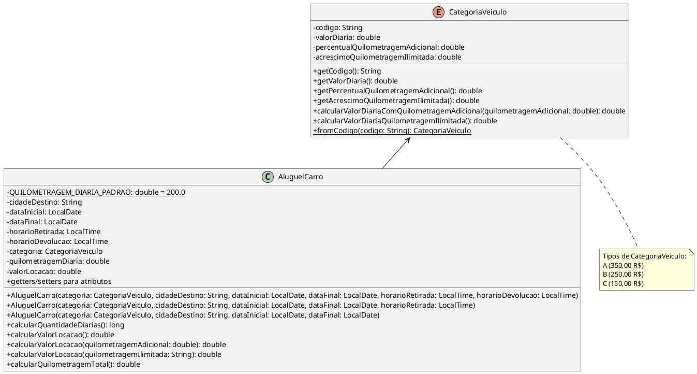

# Sistema de Aluguel de Carros

Este projeto implementa um sistema de aluguel de carros com diferentes categorias de veículos. O sistema permite calcular o valor da locação com base no número de diárias, categoria do veículo e opções de quilometragem.

## Diagrama de Classes



## Descrição das Classes

### Classe `AluguelCarro`

Representa o aluguel de um carro com informações sobre datas, horários, categoria do veículo e cálculos de valor.

#### Atributos:

- `QUILOMETRAGEM_DIARIA_PADRAO`: Valor constante de 200.0 km para a quilometragem diária padrão.
- `cidadeDestino`: Cidade de destino do aluguel.
- `dataInicial`: Data de início da locação.
- `dataFinal`: Data de término da locação.
- `horarioRetirada`: Horário de retirada do veículo.
- `horarioDevolucao`: Horário de devolução do veículo.
- `categoria`: Categoria do veículo (enum `CategoriaVeiculo`).
- `quilometragemDiaria`: Quilometragem diária permitida.
- `valorLocacao`: Valor total da locação.

#### Métodos:

- `calcularQuantidadeDiarias()`: Calcula o número de diárias com base nas datas e horários.
- `calcularValorLocacao()`: Calcula o valor da locação padrão.
- `calcularValorLocacao(quilometragemAdicional)`: Calcula o valor da locação com quilometragem adicional.
- `calcularValorLocacao(quilometragemIlimitada)`: Calcula o valor da locação com quilometragem ilimitada.
- `calcularQuilometragemTotal()`: Calcula a quilometragem total permitida durante o período de locação.

### Enum `CategoriaVeiculo`

Define as categorias disponíveis de veículos com seus valores e regras de cobrança.

#### Valores:

- `A`: Categoria premium (R$ 350,00/dia)
- `B`: Categoria intermediária (R$ 250,00/dia)
- `C`: Categoria básica (R$ 150,00/dia)

#### Atributos:

- `codigo`: Código da categoria (A, B ou C).
- `valorDiaria`: Valor base da diária para a categoria.
- `percentualQuilometragemAdicional`: Percentual cobrado por quilômetro adicional.
- `acrescimoQuilometragemIlimitada`: Valor adicional cobrado para quilometragem ilimitada.

#### Métodos:

- `calcularValorDiariaComQuilometragemAdicional(quilometragemAdicional)`: Calcula o valor da diária com adição de quilometragem.
- `calcularValorDiariaQuilometragemIlimitada()`: Calcula o valor da diária com quilometragem ilimitada.
- `fromCodigo(codigo)`: Método estático para obter a categoria pelo código.

## Visualização do Diagrama

O diagrama de classes acima está escrito em notação PlantUML. Para visualizar o diagrama:

1. **Online**: Copie o código entre as tags ```plantuml e cole em um visualizador online como:

   - [PlantUML Online Server](https://www.plantuml.com/plantuml/uml/)
   - [PlantText](https://www.planttext.com/)
   - [PlantUML Editor](https://plantuml-editor.kkeisuke.com/)

2. **VS Code**: Se estiver usando o Visual Studio Code, instale a extensão "PlantUML" e utilize a funcionalidade de pré-visualização:
   - Instale a extensão "PlantUML" na área de extensões do VS Code
   - Com o README aberto, pressione Alt+D (ou Option+D no Mac) para abrir a pré-visualização

3. **Local**: Instale o [PlantUML](https://plantuml.com/download) localmente e renderize o diagrama usando a ferramenta de linha de comando:
   ```bash
   java -jar plantuml.jar README.md
   ```

## Relação entre as Classes

A classe `AluguelCarro` possui uma relação de associação com `CategoriaVeiculo`, onde cada aluguel está associado a uma categoria específica de veículo. A categoria determina o valor base da diária e as regras para cálculo de adicionais de quilometragem.

## Detalhes de Implementação

- **Sobrecarga de métodos**: A classe `AluguelCarro` utiliza sobrecarga nos construtores e no método `calcularValorLocacao()` para oferecer diferentes opções de configuração.
- **Enum com comportamento**: O enum `CategoriaVeiculo` não apenas define constantes, mas também encapsula comportamentos relacionados à categoria através de métodos.
- **Cálculo de diárias**: Considera não apenas as datas, mas também os horários de retirada e devolução.
