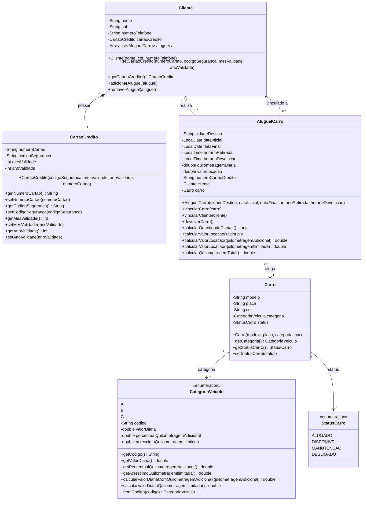

# Sistema de Aluguel de Carros UFBAir

Sistema completo de gestão de aluguel de carros desenvolvido em Java, com suporte a múltiplas categorias de veículos, gestão de clientes e reservas.

## Diagrama de Classes



## Descrição das Classes

### Classe `Cliente`

Representa um cliente do sistema de aluguel.

**Atributos:**
- `nome`: Nome completo do cliente
- `cpf`: CPF do cliente
- `numeroTelefone`: Telefone de contato
- `cartaoCredito`: Cartão de crédito para pagamento (composição)
- `alugueis`: Lista de aluguéis realizados pelo cliente

**Métodos principais:**
- `setCartaoCredito()`: Cadastra ou atualiza o cartão de crédito do cliente
- `adicionarAluguel()`: Adiciona um aluguel à lista (verifica duplicatas)
- `removerAluguel()`: Remove um aluguel da lista

**Relacionamentos:**
- Possui um CartaoCredito (composição 1:1)
- Realiza vários AluguelCarro (agregação 1:N)

### Classe `CartaoCredito`

Representa o cartão de crédito do cliente.

**Atributos:**
- `numeroCartao`: Número do cartão
- `codigoSeguranca`: Código de segurança (CVV)
- `mesValidade`: Mês de validade
- `anoValidade`: Ano de validade

**Características:**
- Pertence exclusivamente a um cliente
- Todos os dados podem ser alterados pelo cliente

### Classe `AluguelCarro`

Classe central que representa uma reserva/aluguel de veículo.

**Atributos:**
- `QUILOMETRAGEM_DIARIA_PADRAO`: Constante 200.0 km
- `cidadeDestino`: Cidade de retirada do veículo
- `dataInicial`, `dataFinal`: Período do aluguel
- `horarioRetirada`, `horarioDevolucao`: Horários de retirada e devolução
- `quilometragemDiaria`: Quilometragem permitida por dia
- `valorLocacao`: Valor total calculado
- `numeroCartaoCredito`: Número do cartão usado na reserva
- `cliente`: Cliente que realizou a reserva
- `carro`: Veículo alugado

**Métodos principais:**
- `vincularCarro()`: Vincula um carro disponível ao aluguel (altera status para ALUGADO)
- `vincularCliente()`: Vincula o cliente e armazena número do cartão
- `devolverCarro()`: Finaliza o aluguel e libera o carro (status DISPONIVEL)
- `calcularQuantidadeDiarias()`: Calcula dias considerando horários
- `calcularValorLocacao()`: 3 versões (padrão, com km adicional, ilimitada)
- `calcularQuilometragemTotal()`: Retorna km total permitida

**Regras de negócio:**
- Só aceita carros com status DISPONIVEL
- Cliente precisa ter cartão cadastrado
- Horário devolução após retirada conta como diária extra

### Classe `Carro`

Representa um veículo disponível para locação.

**Atributos:**
- `modelo`: Modelo do veículo
- `placa`: Placa do veículo
- `cor`: Cor do veículo
- `categoria`: Categoria (A, B ou C)
- `status`: Status atual (enum StatusCarro)

**Características:**
- Status inicial sempre DISPONIVEL
- Pode ser alugado múltiplas vezes em períodos diferentes
- Status controlado pelos métodos de AluguelCarro

### Enum `CategoriaVeiculo`

Define as categorias de veículos com valores e regras específicas.

**Valores disponíveis:**

| Categoria | Valor Diária | % KM Adicional | Acréscimo Ilimitada |
|-----------|--------------|----------------|---------------------|
| A         | R$ 350,00    | 30%            | R$ 70,00            |
| B         | R$ 250,00    | 25%            | R$ 60,00            |
| C         | R$ 150,00    | 20%            | R$ 50,00            |

**Métodos:**
- `calcularValorDiariaComQuilometragemAdicional()`: Adiciona percentual sobre km extra
- `calcularValorDiariaQuilometragemIlimitada()`: Adiciona valor fixo para plano ilimitado
- `fromCodigo()`: Método estático para obter categoria por código

### Enum `StatusCarro`

Define os possíveis estados de um veículo.

**Valores:**
- `DISPONIVEL`: Carro disponível para aluguel
- `ALUGADO`: Carro atualmente alugado
- `MANUTENCAO`: Carro em manutenção
- `DESLIGADO`: Carro desativado do sistema

## Relacionamentos entre Classes

**Composição (parte-todo):**
- Cliente possui CartaoCredito: o cartão não existe sem o cliente

**Agregação (tem-um):**
- Cliente tem lista de AluguelCarro: aluguéis podem existir independentemente
- AluguelCarro referencia Cliente e Carro

**Associação simples:**
- Carro usa CategoriaVeiculo e StatusCarro (enums)

## Regras de Negócio Implementadas

**Cálculo de Diárias:**
- Baseado na diferença entre datas inicial e final
- Se horário devolução > horário retirada: conta 1 diária adicional
- Quilometragem padrão: 200 km/dia acumulável

**Modalidades de Locação:**
1. **Padrão**: Quilometragem padrão (200 km/dia)
2. **Com km adicional**: Valor base + percentual sobre km extra
3. **Ilimitada**: Valor base + acréscimo fixo, km = infinito

**Controle de Status:**
- Apenas carros DISPONIVEL podem ser alugados
- Ao vincular carro: status → ALUGADO
- Ao devolver carro: status → DISPONIVEL

**Validações:**
- Cliente precisa ter cartão cadastrado para reservar
- Não permite adicionar aluguel duplicado na lista do cliente
- Valida status do carro antes de vincular

## Como Visualizar o Diagrama

O diagrama acima usa sintaxe Mermaid e pode ser visualizado:

1. **GitHub/GitLab**: Renderização automática em arquivos README.md
2. **VS Code**: Instale extensões como "Markdown Preview Mermaid Support"
3. **Online**: Use o [Mermaid Live Editor](https://mermaid.live/)
4. **Markdown Viewers**: Maioria dos visualizadores modernos suportam Mermaid

## Exemplo de Uso

```java
// Criar cliente
Cliente cliente = new Cliente("João Silva", "123.456.789-00", "(71) 99999-9999");
cliente.setCartaoCredito("1234567890123456", "123", 12, 2025);

// Criar carro
Carro carro = new Carro("Fiat Uno", "ABC-1234", CategoriaVeiculo.C, "Branco");

// Criar aluguel
AluguelCarro aluguel = new AluguelCarro("Salvador", 
    LocalDate.of(2025, 10, 24), 
    LocalDate.of(2025, 10, 27),
    LocalTime.of(8, 0), 
    LocalTime.of(18, 0));

// Vincular cliente e carro
aluguel.vincularCliente(cliente);
aluguel.vincularCarro(carro);

// Calcular valor (3 diárias de categoria C)
double valor = aluguel.calcularValorLocacao(); // 3 x R$ 150 = R$ 450

// Devolver carro
aluguel.devolverCarro(); // Status do carro volta para DISPONIVEL
```
